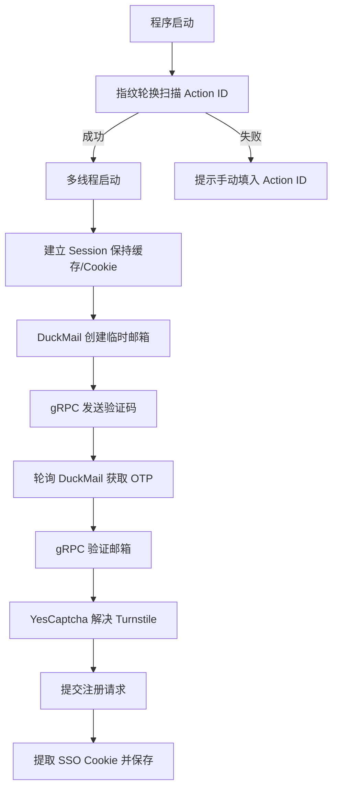

# Grok 注册机实现原理手册

本文档详细说明了该注册机如何绕过 Cloudflare 验证并实现自动化注册的核心技术细节。

## 1. Cloudflare 防护绕过 (WAF & Bot Detection)

### 浏览器指纹模拟 (TLS/HTTP2 Fingerprinting)
程序使用 `curl_cffi` 库替代标准的 `requests`，核心原因在于其支持 **Impersonate** 功能。
- **TLS 指纹**: 模拟特定浏览器版本（如 Chrome 120, Safari 15）的 TLS 握手特征。
- **指纹轮换**: `grok.py` 在初始化和注册逻辑中内置了指纹轮换机制。如果一个指纹被 Cloudflare 拦截（403 错误），程序会自动切换到下一个指纹（如从 Chrome 切到 Firefox）重新尝试。

### 动态参数解析 (Next.js Action ID)
Grok 的注册接口受 Next.js 的路由保护，需要一个动态的 `next-action` ID。
1. **自动扫描**: 程序首先访问 `/sign-up` 页面，解析页面引用的所有 `/_next/static/chunks/` 下的 JS 文件。
2. **正则提取**: 在 JS 内容中匹配 `7f` 开头的 42 位长度的 Hex 字符串。
3. **手动覆盖**: 鉴于机房 IP 可能被 Cloudflare 深度封档导致无法加载 JS，程序支持在 `.env` 中通过 `GROK_ACTION_ID` 手动设置此 ID。

## 2. 邮件自动化流程 (DuckMail 适配)

注册机已深度集成 **DuckMail** API：
- **自动开户**: 每次注册请求都会实时调用 `/accounts` 接口创建一个新的 `@duckmail.sbs` 邮箱。
- **OTP 提取**: 
  - 通过轮询 `/messages` 接口获取新邮件。
  - 使用正则表达式支持 Grok 特有的 `XXX-XXX` 混合验证码和传统的 6 位纯数字验证码。
  - 自动剥离验证码中的连字符（`-`）以适配 gRPC 接口要求。

## 3. gRPC-Web 通讯协议

Grok 的后端接口（如 `CreateEmailValidationCode`）使用 **gRPC-Web (Protocol Buffers)**。
- 程序实现了精简的二进制编码器（`encode_grpc_message`），将电子邮件地址和验证码包装成符合 Protobuf 格式的二进制流。
- 设置特定的请求头 `content-type: application/grpc-web+proto` 以触发服务器端的 gRPC 解析逻辑。

## 4. 自动化注册流水线

## 5. 多线程与并发控制

- **线程安全**: 使用 `threading.Lock` 保护文件写入操作，确保 `keys/grok.txt` 不会出现混乱。
- **资源隔离**: 每个线程拥有独立的 `requests.Session` 和指纹，互不干扰，最大限度降低被关联封禁的风险。
- **容错处理**: 线程内包含完整的异常捕获机制，单个注册失败或邮箱超时不会导致整个进程崩溃。
